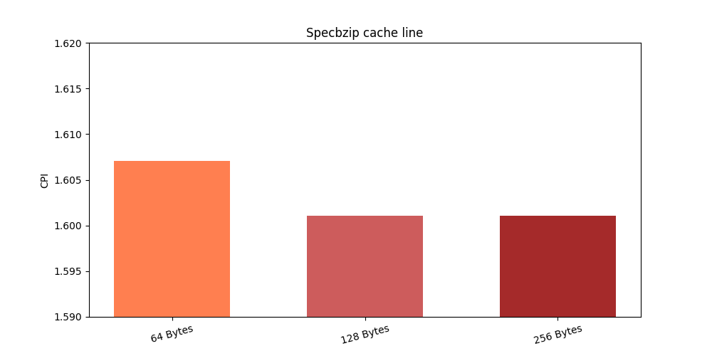

# Αρχιτεκτονική Υπολογιστών - Εργασία 1 - Report

## Μέρος 1ο: Μια ματιά του starter_se.py
Κοιτάζοντας το starter_se.py μπορούμε να δούμε αρχικά τα προεπιλεγμένα command-line-args που λαμβάνει το script.
Βασίζεται στο ενσωματωμένο(builtin) python module "argparse".
Τα στοιχεία που έλαβα διαβάζοντας τον πηγαίο κώδικα είναι:
1. --cpu				atomic
2. --cpu-freq		4GHz
3. --num-cores		1
4. --mem-type		DDR3_1600_8x8
5. --mem-channels	2
6. --mem-ranks		None
7. --mem-size		2GB

Ψάχνοντας στο διαδίκτυο εντόπισα τις λειτουργίες των παραπάνω επιλογών καθώς και επιπλέον επιλογές.
1. Από το παράδειγμα που δίνει η άσκηση, μόνο η παράμετρος "--cpu="minor"" είναι διαφορετική. Υπάρχουν 3 είδη cpu που δηλώνονται στο dictionary "cpu_types": {"atomic","minor", "hpi"}. Το "atomic" είναι default αλλά εμείς διαλέξαμε το "minor"
2. Η παράμετρος "cpu-freq" ορίζει προφανώς μία συχνότητα.
3. Αριθμός πυρήνων του "CpuCluster"
4. Είδος της μνήμης (DDR3_1600_8x8)
5. Αριθμός καναλιών μνήμης (2)
6. Αριθμός memory ranks. Όταν είναι "None" ρυθμίζεται από αλλού[1][2]. Στην περίπτωσή μας η μνήμη DDR3_1600_8x8 θέτει 2 ranks per channel.
7. Μέγεθος μνήμης, 2GB.


## Μέρος 2ο: Επαληθεύοντας από τα config files.
### α) Εν τέλει θα κοιτάξω μόνο από το config.ini καθώς είναι το ίδιο με το config.json αλλά πιο ευανάγνωστο για ανθρώπους. 
1. Ο cpu πράγματι είναι τύπου "type=MinorCPU" όπως φαίνεται στην ενότητα "[system.cpu_cluster.cpus]"
2. Έχουμε:`[system.clk_domain]
type=SrcClockDomain
clock=1000`. Άρα 1000 ticks per cycle, και `[system.cpu_cluster.clk_domain]
type=SrcClockDomain
clock=250` άρα 250 ticks per cycle. Δηλαδή 1000000000000 / 1000 = 1GHz και 4GHz αντίστοιχα.
3. Υπάρχει μόνο ένα cpu_id=0 άρα μόνο ένας πυρήνας.
4. Μετά από ψάξιμο φαίνεται πως οι παράμετροι των "system.mem_ctrls0.dram" και "system.mem_ctrls1.dram" συμπίπτουν με αυτές της "DDR3_1600_8x8" όπως φαίνονται στο "DRAMInterface.py". 
5. 2 Κανάλια γιατί έχουμε 2 memory modules: system.mem_ctrls0 και system.mem_ctrls1
6. Πράγματι, έχουμε "ranks_per_channel=2" για κάθε module, όπως ισχύει στο "DRAMInterface.py"
8. Έχουμε "device_size=536870912" για κάθε 536870912 / (1024 * 1024) = 512 Mbytes.


Σχετικά με τους caches: Έχουμε L1d και L1i για δεδομένα και εντολές αντίστοιχα[2], L2 και walkcache. To L1d (dcache) έχει μέγεθος 32768 = 32 KB (size=32768) και το L1i 49152 = 48KB size=49152. Το walker_cache έχει μέγεθος 1ΚΒ (size=1024) και το L2 1MB (size=1048576).

Όλα αυτά φαίνονται μαζί και με όλες τις παραμέτρους των caches στις ενότητες: 
```
system.cpu_cluster.cpus.icache
system.cpu_cluster.cpus.dcache
system.cpu_cluster.l2
```
### β) commited εντολές.
Έχουμε 5028 committed instructions. `system.cpu_cluster.cpus.committedInsts         5028`.Επιπλέον έχουμε 5834 committed ops. `system.cpu_cluster.cpus.committedOps             5834`
Τελικά η διαφορά έχει να κάνει με το γεγονός ότι ο στα ops προσμετρώνται και τα micro-ops [4] τα οποία είναι περισσότερα από τα ops. Αυτό ισχύει ιδιαιτέρως στην αρχιτεκτονική της intel που από κάτω είναι απλή RISC αλλά ισχύει σε μικτότερο βαθμό ακόμα και στην RISC ARM[5].

### γ) Προσπελάσεις L2 cache.
Συνολικά η L2 cache προσπελάστηκε 479 φορές, όπως φαίνεται και από την καταχώρηση `system.cpu_cluster.l2.overall_accesses::total          479` στο status.txt.
Οι προσπελάσεις της L2 μπορούν να υπολογιστούν έμμεσα από τα misses της L1i L1d (dcache και icache):
`system.cpu_cluster.cpus.dcache.demand_mshr_misses::total          147` και `system.cpu_cluster.cpus.icache.demand_misses::.cpu_cluster.cpus.inst          332`.
Σύνολο δηλαδή: 147 + 332 = 479

## Μέρος 3ο
### α) Τα κύρια μοντέλα cpu που διαθέτει ο gem5 είναι τα εξής[6][7][8]:

1. SimpleCPU: Πρόκειται για πολύ απλό μοντέλο που απλά εκτελεί τις εντολές in-order και δεν έχει pipeline. Οι εντολές εκτολούνται δηλαδή σαν συναρτήσεις και τα memory latencies είτε είναι μηδενικά είτε βασίζονται σε απλές εκτιμήσεις. Χρησιμοποιείται συνήθως για την ταχύτητά του ώστε για παράδειγμα να ξεκινήσει έναν linux kernel και μετά γίνεται checkpoint και αλλαγή σε ένα πιο ακριβές μοντέλο
2. MinorCPU: Πρόκειται για πληρέστερο in-order μοντέλο, με ένα 4-stage pipeline [9]. Είναι εύλικτο, δηλαδή ππορεί να παραμετροπιηθεί ώστε να συνθέσει ένα πιο σύνθετο μοντέλο που προσοποιάζει έναν συγκεκριμένο επεξεργαστή με ανάλογες δυνατότητες.
3. O3CPU: Πρόκειται για ένα out-of-order μοντέλο με 5-stage pipeline. Έχουν γίνει προσπάθειες να είναι ιδιαίτερα ακριβές στους χρονισμούς του(timing accurate).


**[1]**: Γραμμή 210 από MemConfig.py `if issubclass(intf, m5.objects.DRAMInterface) and \
                   opt_mem_ranks:00
                    dram_intf.ranks_per_channel = opt_mem_ranks`και 277 από DRAMInterface.py `ranks_per_channel = 2`.
**[2]**: https://en.wikipedia.org/wiki/CPU_cache#History
**[3]**: https://en.wikipedia.org/wiki/Micro-operation
**[4]**: http://learning.gem5.org/book/part1/gem5_stats.html
**[5]**: https://superuser.com/questions/934752/do-arm-processors-like-cortex-a9-use-microcode
**[6]**: https://www.gem5.org/documentation/general_docs/cpu_models/SimpleCPU
**[7]**: https://stackoverflow.com/questions/58554232/what-is-the-difference-between-the-gem5-cpu-models-and-which-one-is-more-accurat
**[8]**: https://www.gem5.org/documentation/general_docs/cpu_models/minor_cpu
**[9]**: http://pages.cs.wisc.edu/~swilson/gem5-docs/classMinorCPU.html

# Αρχιτεκτονική Υπολογιστών - Εργασία 2 - Report

## Βήμα 1
### 1.
```
cache_line_size=64

[system.cpu.dcache]
assoc=2
size=65536

[system.cpu.icache]
assoc=2
size=32768

[system.l2]
assoc=8
size=2097152
```

## 2. και 3.

| 1GHZ | Χρόνος | CPI | L1d misses | L2i misses | L2 misses |
|---|---|---|---|---|---|
| specbzip | 160.703 | 1.607035 | 0.014133 | 0.000076 | 0.294739 |
| specmcf | 109.233 | 1.092334 | 0.002038 | 0.000037 | 0.727788 |
| spechmmer | 118.547 | 1.185466 | 0.001684 | 0.000204 | 0.079949 |
| specsjeng | 705.453 | 7.054533 | 0.121829 | 0.000020 | 0.999979 |
| speclibm | 262.248 | 2.622476 | 0.060971 | 0.000098 | 0.999927 |


| 2GHZ | Χρόνος | CPI | L1d misses | L2i misses | L2 misses |
|---|---|---|---|---|---|
| specbzip | 83.847 | 1.676947 | 0.014289 | 0.000075 | 0.294749 |
| specmcf | 55.471 | 1.109419 | 0.002038 | 0.000037 | 0.727788 |
| spechmmer | 59.410 | 1.188197 | 0.001692 | 0.000204 | 0.079948 |
| specsjeng | 513.819 | 10.276385 | 0.121829 | 0.000020 | 0.999979 |
| speclibm | 174.779 | 3.495573 | 0.060971 | 0.000098 | 0.999927 |

### System clock VS Cpu Cluster clock

### system.cpu_clk_domain και system.clk_domain
Η παράμετρος "cpu_clk_domain" ρυθμίζει τον cpu clock και τους L1d, L2i, και L2 caches ενώ η παράμετρος "clk_domain" ρυθμίζει το mmu, dvfs handler, memoryctrls, memory bus. Αν προστεθεί ένας ακόμη cpu, θα πάρει clock από το cpu_clk_domain.


#### Χρόνος εκτέλεσης.

Παρατηρώ ότι τα benchmark που έχουν μεγάλο miss-rate, ιδίως τα specsjeng και speclibm
έχουν κακό scaling της απόδοσης σε σχέση με το διπλασιασμό της συχνότητας. Τα πολλά misses συμβάλουν στην σπατάλη κύκλων του επεξερτγαστή, και καθώς τα cache latencies είναι ανεξάρτητα της συχνότητας, παίρνουν τον ίδιο χρόνο. Επομένως στα 2GHz θα έχουμε περισσότερους κύκλους που χάνονται περιμένοντας την μνήμη. Αντίθετα τα benches που έχουν χαμηλά miss-rate έχουν καλό scaling και αυτό αντανακλάται στο CPI που δεν ανεβαίνει πολύ.

## Βήμα 2
### 401.bzip2
- L1i Cache

- L1d Cache

- L2 Cache

- Cache Line Size


### 401.bzip2
- L1i Cache

- L1d Cache

- L2 Cache

- Cache Line Size


### 401.bzip2
- L1i Cache

- L1d Cache

- L2 Cache

- Cache Line Size


### 401.bzip2
- L1i Cache

- L1d Cache

- L2 Cache

- Cache Line Size


### 401.bzip2
- L1i Cache

- L1d Cache

- L2 Cache

- Cache Line Size


