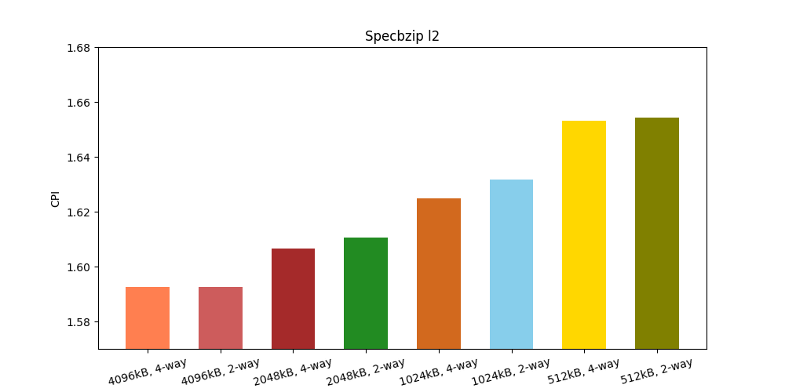

# Αρχιτεκτονική Υπολογιστών - Εργασία 1 - Report

## Μέρος 1ο: Μια ματιά του starter_se.py
Κοιτάζοντας το starter_se.py μπορούμε να δούμε αρχικά τα προεπιλεγμένα command-line-args που λαμβάνει το script.
Βασίζεται στο ενσωματωμένο(builtin) python module "argparse".
Τα στοιχεία που έλαβα διαβάζοντας τον πηγαίο κώδικα είναι:
1. --cpu				atomic
2. --cpu-freq		4GHz
3. --num-cores		1
4. --mem-type		DDR3_1600_8x8
5. --mem-channels	2
6. --mem-ranks		None
7. --mem-size		2GB

Ψάχνοντας στο διαδίκτυο εντόπισα τις λειτουργίες των παραπάνω επιλογών καθώς και επιπλέον επιλογές.
1. Από το παράδειγμα που δίνει η άσκηση, μόνο η παράμετρος "--cpu="minor"" είναι διαφορετική. Υπάρχουν 3 είδη cpu που δηλώνονται στο dictionary "cpu_types": {"atomic","minor", "hpi"}. Το "atomic" είναι default αλλά εμείς διαλέξαμε το "minor"
2. Η παράμετρος "cpu-freq" ορίζει προφανώς μία συχνότητα.
3. Αριθμός πυρήνων του "CpuCluster"
4. Είδος της μνήμης (DDR3_1600_8x8)
5. Αριθμός καναλιών μνήμης (2)
6. Αριθμός memory ranks. Όταν είναι "None" ρυθμίζεται από αλλού[1][2]. Στην περίπτωσή μας η μνήμη DDR3_1600_8x8 θέτει 2 ranks per channel.
7. Μέγεθος μνήμης, 2GB.


## Μέρος 2ο: Επαληθεύοντας από τα config files.
### α) Εν τέλει θα κοιτάξω μόνο από το config.ini καθώς είναι το ίδιο με το config.json αλλά πιο ευανάγνωστο για ανθρώπους. 
1. Ο cpu πράγματι είναι τύπου "type=MinorCPU" όπως φαίνεται στην ενότητα "[system.cpu_cluster.cpus]"
2. Έχουμε:`[system.clk_domain]
type=SrcClockDomain
clock=1000`. Άρα 1000 ticks per cycle, και `[system.cpu_cluster.clk_domain]
type=SrcClockDomain
clock=250` άρα 250 ticks per cycle. Δηλαδή 1000000000000 / 1000 = 1GHz και 4GHz αντίστοιχα.
3. Υπάρχει μόνο ένα cpu_id=0 άρα μόνο ένας πυρήνας.
4. Μετά από ψάξιμο φαίνεται πως οι παράμετροι των "system.mem_ctrls0.dram" και "system.mem_ctrls1.dram" συμπίπτουν με αυτές της "DDR3_1600_8x8" όπως φαίνονται στο "DRAMInterface.py". 
5. 2 Κανάλια γιατί έχουμε 2 memory modules: system.mem_ctrls0 και system.mem_ctrls1
6. Πράγματι, έχουμε "ranks_per_channel=2" για κάθε module, όπως ισχύει στο "DRAMInterface.py"
8. Έχουμε "device_size=536870912" για κάθε 536870912 / (1024 * 1024) = 512 Mbytes.


Σχετικά με τους caches: Έχουμε L1d και L1i για δεδομένα και εντολές αντίστοιχα[2], L2 και walkcache. To L1d (dcache) έχει μέγεθος 32768 = 32 KB (size=32768) και το L1i 49152 = 48KB size=49152. Το walker_cache έχει μέγεθος 1ΚΒ (size=1024) και το L2 1MB (size=1048576).

Όλα αυτά φαίνονται μαζί και με όλες τις παραμέτρους των caches στις ενότητες: 
```
system.cpu_cluster.cpus.icache
system.cpu_cluster.cpus.dcache
system.cpu_cluster.l2
```
### β) commited εντολές.
Έχουμε 5028 committed instructions. `system.cpu_cluster.cpus.committedInsts         5028`.Επιπλέον έχουμε 5834 committed ops. `system.cpu_cluster.cpus.committedOps             5834`
Τελικά η διαφορά έχει να κάνει με το γεγονός ότι ο στα ops προσμετρώνται και τα micro-ops [4] τα οποία είναι περισσότερα από τα ops. Αυτό ισχύει ιδιαιτέρως στην αρχιτεκτονική της intel που από κάτω είναι απλή RISC αλλά ισχύει σε μικτότερο βαθμό ακόμα και στην RISC ARM[5].

### γ) Προσπελάσεις L2 cache.
Συνολικά η L2 cache προσπελάστηκε 479 φορές, όπως φαίνεται και από την καταχώρηση `system.cpu_cluster.l2.overall_accesses::total          479` στο status.txt.
Οι προσπελάσεις της L2 μπορούν να υπολογιστούν έμμεσα από τα misses της L1i L1d (dcache και icache):
`system.cpu_cluster.cpus.dcache.demand_mshr_misses::total          147` και `system.cpu_cluster.cpus.icache.demand_misses::.cpu_cluster.cpus.inst          332`.
Σύνολο δηλαδή: 147 + 332 = 479

## Μέρος 3ο
### α) Τα κύρια μοντέλα cpu που διαθέτει ο gem5 είναι τα εξής[6][7][8]:

1. SimpleCPU: Πρόκειται για πολύ απλό μοντέλο που απλά εκτελεί τις εντολές in-order και δεν έχει pipeline. Οι εντολές εκτολούνται δηλαδή σαν συναρτήσεις και τα memory latencies είτε είναι μηδενικά είτε βασίζονται σε απλές εκτιμήσεις. Χρησιμοποιείται συνήθως για την ταχύτητά του ώστε για παράδειγμα να ξεκινήσει έναν linux kernel και μετά γίνεται checkpoint και αλλαγή σε ένα πιο ακριβές μοντέλο
2. MinorCPU: Πρόκειται για πληρέστερο in-order μοντέλο, με ένα 4-stage pipeline [9]. Είναι εύλικτο, δηλαδή ππορεί να παραμετροπιηθεί ώστε να συνθέσει ένα πιο σύνθετο μοντέλο που προσοποιάζει έναν συγκεκριμένο επεξεργαστή με ανάλογες δυνατότητες.
3. O3CPU: Πρόκειται για ένα out-of-order μοντέλο με 5-stage pipeline. Έχουν γίνει προσπάθειες να είναι ιδιαίτερα ακριβές στους χρονισμούς του(timing accurate).


**[1]**: Γραμμή 210 από MemConfig.py `if issubclass(intf, m5.objects.DRAMInterface) and \
                   opt_mem_ranks:00
                    dram_intf.ranks_per_channel = opt_mem_ranks`και 277 από DRAMInterface.py `ranks_per_channel = 2`.
**[2]**: https://en.wikipedia.org/wiki/CPU_cache#History
**[3]**: https://en.wikipedia.org/wiki/Micro-operation
**[4]**: http://learning.gem5.org/book/part1/gem5_stats.html
**[5]**: https://superuser.com/questions/934752/do-arm-processors-like-cortex-a9-use-microcode
**[6]**: https://www.gem5.org/documentation/general_docs/cpu_models/SimpleCPU
**[7]**: https://stackoverflow.com/questions/58554232/what-is-the-difference-between-the-gem5-cpu-models-and-which-one-is-more-accurat
**[8]**: https://www.gem5.org/documentation/general_docs/cpu_models/minor_cpu
**[9]**: http://pages.cs.wisc.edu/~swilson/gem5-docs/classMinorCPU.html

# Αρχιτεκτονική Υπολογιστών - Εργασία 2 - Report

## Βήμα 1
### 1.
```
cache_line_size=64

[system.cpu.dcache]
assoc=2
size=65536

[system.cpu.icache]
assoc=2
size=32768

[system.l2]
assoc=8
size=2097152
```

## 2. και 3.

| 1GHZ | Χρόνος | CPI | L1d misses | L2i misses | L2 misses |
|---|---|---|---|---|---|
| specbzip | 160.703 | 1.607035 | 0.014133 | 0.000076 | 0.294739 |
| specmcf | 109.233 | 1.092334 | 0.002038 | 0.000037 | 0.727788 |
| spechmmer | 118.547 | 1.185466 | 0.001684 | 0.000204 | 0.079949 |
| specsjeng | 705.453 | 7.054533 | 0.121829 | 0.000020 | 0.999979 |
| speclibm | 262.248 | 2.622476 | 0.060971 | 0.000098 | 0.999927 |


| 2GHZ | Χρόνος | CPI | L1d misses | L2i misses | L2 misses |
|---|---|---|---|---|---|
| specbzip | 83.847 | 1.676947 | 0.014289 | 0.000075 | 0.294749 |
| specmcf | 55.471 | 1.109419 | 0.002038 | 0.000037 | 0.727788 |
| spechmmer | 59.410 | 1.188197 | 0.001692 | 0.000204 | 0.079948 |
| specsjeng | 513.819 | 10.276385 | 0.121829 | 0.000020 | 0.999979 |
| speclibm | 174.779 | 3.495573 | 0.060971 | 0.000098 | 0.999927 |

### System clock VS Cpu Cluster clock

### system.cpu_clk_domain και system.clk_domain
Η παράμετρος "cpu_clk_domain" ρυθμίζει τον cpu clock και τους L1d, L2i, και L2 caches ενώ η παράμετρος "clk_domain" ρυθμίζει το mmu, dvfs handler, memoryctrls, memory bus. Αν προστεθεί ένας ακόμη cpu, θα πάρει clock από το cpu_clk_domain.


#### Χρόνος εκτέλεσης.

Παρατηρώ ότι τα benchmark που έχουν μεγάλο miss-rate, ιδίως τα specsjeng και speclibm
έχουν κακό scaling της απόδοσης σε σχέση με το διπλασιασμό της συχνότητας. Τα πολλά misses συμβάλουν στην σπατάλη κύκλων του επεξερτγαστή, και καθώς τα cache latencies είναι ανεξάρτητα της συχνότητας, παίρνουν τον ίδιο χρόνο. Επομένως στα 2GHz θα έχουμε περισσότερους κύκλους που χάνονται περιμένοντας την μνήμη. Αντίθετα τα benches που έχουν χαμηλά miss-rate έχουν καλό scaling και αυτό αντανακλάται στο CPI που δεν ανεβαίνει πολύ.

## Βήμα 2
### 401.bzip2
- L1i Cache

- L1d Cache

- L2 Cache

- Cache Line Size


### 429.mcf
- L1i Cache

- L1d Cache

- L2 Cache

- Cache Line Size


### 456.hmmer
- L1i Cache

- L1d Cache

- L2 Cache

- Cache Line Size


### 458.sjeng
- L1i Cache

- L1d Cache

- L2 Cache

- Cache Line Size


### 470.lbm
- L1i Cache

- L1d Cache

- L2 Cache

- Cache Line Size


## Βήμα 3
### Κατασκευή Συνάρτησης Κόστους
Και η l1 και η l1 caches τυπικά φτιάχνονται από SRAM Cells, αλλά η l1 είναι βελτιστοποιημένη για απόδοση.(φτιάχνεται με ελαφρώς μεγαλύτερα τρανζίστορ και παχύτερα καλώδια) ενώ η l2 βελτιστοπιείται για μεγάλη πυκνότητα λογικής.
Η φόρμουλα που κατέληξα είναι: l1*8 + l2 + ((l1_assoc-c1*l1)^1.2) + ((l2_assoc-c1*l2)^1.2) + cls
όπου l1 και l2 τα μεγεθη των caches, l1_assoc και l2_assoc τα αντίστοιχα associativities, cls το cache line size και c1,c2 απροσδιόριστες σταθερες. Οι όροι των associativities μοντελοποιούν τη μη γραμμική αύξηση της ενέργειας ανάγνωσης δεδομένων και οι όροι c1*l1 και c2*l2 μοντελοποιούν το γεγονός ότι για μεγαλύτερα caches το φαινόμενο είναι πιο ήπιο. (Figure 2.9 από Patterson, σελίδα 97 στο Αγγλικό βιβλίο).

1. Για το "401.bzip2" επέλεξα το ελάχιστο l1i cache και associativity (64kB, 2-way), καθώς είχαν ελάχιστο αντίκτυπο στο CPI. Αντίθετα, το l1d cache έπαιξε ρόλο και για αυτό επέλεξα (256kB, 2-way) - το associativity επηρεάζει ελάχιστα το CPI. Για το l2 επέλεξα (512kB, 2-way) καθώς οι διαφορές και των δύο αυτών παραμέτρων είναι είναι και εδώ ελάχιστες. Το cache line size είχε μια μικρή διαφορά ως τα 128 bytes αλλά επέλεξα να μην το πάρω για λόγους κόστους.
2. Για το "429.mcf" επέλεξα ξανά (64kB, 2-way) για το l1i καθώς και πάλι οι διαφορές ήταν μηδαμινές. Επίσης αυτή τη φορά και το l1d είχε ελάχιστη διαφορά οπότε πήρα και πάλι (128kB 2-way). Για την l2 διάλεξα 2-way associativity λαμβάνοντας υπόψιν ότι δεν είχε κάποια διαφορά και το μέγεθο στα 2048kB όπου και είχαμε μια μικρή πτώση του CPI, αλλά όχι στα 4096. Τέλος, το cache line size είχε μια μικρή αλλά μη αμελητέα βελτίωση στα 128 bytes αλλά στα 256 όχι μόνο δεν έπεσε το CPI αλλά ανέβηκε. Οπότε επέλεξα 128.
3. Για το "456.hmmer" έλαβα για τους ίδιους λόγους με το "429.mcf" (64kB, 2-way) για την l1i και για την l1d (128kB 2-way). Τα l2 benchmarks είχαν μηδαμινή διαφοροποίηση στην απόδωση οπότε έλαβα (512kB 2-way). Παρομοίως και το cache line size, οπότε έμεινα στα 64 bytes.
4. Για το "458.sjeng" πήρα (64kB, 2-way) για l1i και (128kB 2-way) για l1d, αφού δεν είχε σχεδόν καθόλου διαφορά το CPI. Παρομοίως και στο l2, οπότε επέλεξα (512kB, 2-way). Μόνο το cache line size επηρέασε και αυτό αρκετά, οπότε πήρα 256 Bytes.
5. Εδώ τα γραφήματα του "470.lbm" είναι πολύ όμοια με του "458.sjeng",  οπότε επέλεξα τις ίδιες παραμέτρους και μεγέθη.

# Αρχιτεκτονική Υπολογιστών - Εργασία 3 - Report

## Ερωτήματα
### 1. Dynamic power, Leakage.
Η Διαρροή (Leakage) ή αλλιώς η στατική(Static power) κατανάλωση είναι η κατανάλωση του κυκλώματος ακόμα και όταν αυτό είναι ανενεργό. Διακρίνεται σε Gate Leakage και Subthreshold Leakage. Η πρώτη είναι η διαρροή ρεύματος από την πύλη, καθώς οι σημερινές τεχνολογίες έχουν πολύ μικρό πάχος στο διηλεκτρικό (οξείδιο) πύλης, και έτσι μέσω κβαντικής σηράγγωσης έχουμε διαρροή. Επίσης το Subthreshold Leakage είναι η διαρροή ρεύματος εκκροής-πηγής. Από την άλλη η Δυναμική κατανάλωση συνδέεται με ροή ρεύματος από την φόρτιση και εκφρόρτιση παρασιτικών χωρητικοτήτων. Η εκτέλεση διαφορετικών προγραμμάτων σε έναν επεξεργαστή θα επηρέαζε κυρίως την δυναμική κατανάλωση ισχύος, η οποία εξαρτάται από τις φορτοεκφρτίσεις χωρητικοτήτων ενώ η στατική κατανάλωση δεν επηρεάζεται. Η διαφορά στο χρόνο μεταξύ δύο προγραμμάτων θα επηρεάσει την συνολική ενέργεια που καταναλώνουν αλλά όχι την ισχύ.
### 2. 4 vs 40 Watt CPU
Η διαφορά στην κατανάλωση δεν είναι αρκετή πληροφορία, γιατί μπορεί για παράδειγμα ο πιο ενεργοβόρος επεξεργαστής να είναι αρκετά πιο γρήγορος με αποτέλεσμα να τρέχει για λιγότερη ώρα και να τελειώνει γρηγορότερα. Έτσι η κατανάλωση ενέργειας θα μπορούσε να είναι πιο μικρή τελικά. Για να το ξέρουμε αυτό θα πρέπει να τρέξουμε το προγράμματα στο gem5 για να δούμε ποιός επεξεργαστής είναι πιο αποδοτικός.
### 3. ARM vs XEON
Ο Xeon είναι 40 φορές γρηγορότερος από τον ARM A9, αλλά ο ARM έχει μέγιστη κατανάλωση 1.74189 W σε αντίθεση με τα 134.938 W του Xeon, 77.47 φορές περισσότερη ισχύ. Δηλαδή αν οι επεξεργαστές δούλευαν στη μέγιστη ισχύ τους, ο ARM θα χρειαζόταν μόνο 40 φορές περισσότερο χρόνο από, άρα η ενέργεια που είναι ισχύς επί χρόνος θα ήτανε και πάλι λιγότερηα από τον Xeon. Αλλά ακόμα και αν ο Xeon δε χρησιμοποιούσε την μέγιστη ισχύ του για να κοντράρει τον ARM, έχει πολύ μεγαλύτερη κατανάλωση στατική (Xeon: 36.8319 W, ARM:0.108687 W). Επομένως εάν αφεθούν οι επεξεργαστές να κάθονται σε αδράνεια μετά την εκτέλεση της εφαρμογής, ο Xeon θα ξεπεράσει τον ARM σε ενέργεια.
## Ερωτήματα
### 1. Υπολογισμός Κατανάλωσης Ενέργειας.
Η Ενέργεια υπολογίζεται αν αθροιστούν οι επιμέρους στατικές καταναλώσεις (Subthreshold Leakage, Gate Leakage) με την Runtime Dynamic για τον Core και την L2.


| Benchmark | Κατανάλωση Ισχύος σε W |
| --- | --- |
| specbzip_l2_1024kb_4-way | 1.421 |
| specbzip_cache_line_256_bytes | 3.663 |
| specbzip_l2_2048kb_4-way | 1.430 |
| specbzip_l1d_128kb_2-way | 1.814 |
| specbzip_cache_line_128_bytes | 1.795 |
| specbzip_l1i_128kb_2-way | 2.121 |
| specbzip_l2_2048kb_2-way | 1.429 |
| specbzip_l2_512kb_2-way | 1.411 |
| specbzip_l2_512kb_4-way | 1.411 |
| specbzip_cache_line_64_bytes | 1.430 |
| specbzip_l1i_64kb_4-way | 1.560 |
| specbzip_l2_4096kb_2-way | 1.442 |
| specbzip_l2_1024kb_2-way | 1.419 |
| specbzip_l2_4096kb_4-way | 1.443 |
| specbzip_l1d_256kb_4-way | 1.989 |
| specbzip_l1d_256kb_2-way | 2.113 |
| specbzip_l1i_128kb_4-way | 1.859 |
| specbzip_l1d_128kb_4-way | 1.575 |
| specbzip_l1i_64kb_2-way | 1.835 |
| specsjeng_l2_2048kb_2-way | 1.267 |
| specsjeng_cache_line_128_bytes | 1.602 |
| specsjeng_l2_4096kb_2-way | 1.277 |
| specsjeng_l2_512kb_2-way | 1.257 |
| specsjeng_l1i_64kb_2-way | 1.673 |
| specsjeng_l1i_128kb_4-way | 1.691 |
| specsjeng_l2_512kb_4-way | 1.257 |
| specsjeng_l1d_128kb_2-way | 1.598 |
| specsjeng_l1i_128kb_2-way | 1.958 |
| specsjeng_cache_line_256_bytes | 3.456 |
| specsjeng_l2_2048kb_4-way | 1.268 |
| specsjeng_l2_4096kb_4-way | 1.277 |
| specsjeng_l2_1024kb_2-way | 1.261 |
| specsjeng_l1d_128kb_4-way | 1.349 |
| specsjeng_l1d_256kb_2-way | 1.855 |
| specsjeng_cache_line_64_bytes | 1.268 |
| specsjeng_l2_1024kb_4-way | 1.261 |
| specsjeng_l1i_64kb_4-way | 1.398 |
| specsjeng_l1d_256kb_4-way | 1.696 |
| spechmmer_cache_line_256_bytes | 3.556 |
| spechmmer_l1i_128kb_2-way | 2.164 |
| spechmmer_l1i_128kb_4-way | 1.908 |
| spechmmer_l1d_128kb_2-way | 1.866 |
| spechmmer_l2_4096kb_2-way | 1.479 |
| spechmmer_l2_512kb_4-way | 1.469 |
| spechmmer_l1d_256kb_4-way | 2.050 |
| spechmmer_l2_4096kb_4-way | 1.479 |
| spechmmer_l2_1024kb_2-way | 1.471 |
| spechmmer_l1i_64kb_2-way | 1.879 |
| spechmmer_l1i_64kb_4-way | 1.604 |
| spechmmer_l1d_256kb_2-way | 2.168 |
| spechmmer_l2_2048kb_2-way | 1.474 |
| spechmmer_l2_1024kb_4-way | 1.471 |
| spechmmer_cache_line_64_bytes | 1.474 |
| spechmmer_l2_2048kb_4-way | 1.474 |
| spechmmer_l2_512kb_2-way | 1.469 |
| spechmmer_l1d_128kb_4-way | 1.629 |
| spechmmer_cache_line_128_bytes | 1.803 |
| specmcf_cache_line_64_bytes | 1.454 |
| specmcf_l2_512kb_4-way | 1.449 |
| specmcf_l1d_256kb_2-way | 2.130 |
| specmcf_cache_line_256_bytes | 3.537 |
| specmcf_l1i_64kb_4-way | 1.584 |
| specmcf_l1d_128kb_4-way | 1.598 |
| specmcf_l1d_256kb_4-way | 2.005 |
| specmcf_l2_2048kb_4-way | 1.454 |
| specmcf_l2_1024kb_4-way | 1.451 |
| specmcf_l2_1024kb_2-way | 1.451 |
| specmcf_l1i_128kb_2-way | 2.144 |
| specmcf_l1i_128kb_4-way | 1.888 |
| specmcf_l1i_64kb_2-way | 1.859 |
| specmcf_l2_512kb_2-way | 1.449 |
| specmcf_l2_2048kb_2-way | 1.454 |
| specmcf_l1d_128kb_2-way | 1.838 |
| specmcf_l2_4096kb_4-way | 1.460 |
| specmcf_cache_line_128_bytes | 1.771 |
| specmcf_l2_4096kb_2-way | 1.460 |
| speclibm_l2_1024kb_4-way | 1.314 |
| speclibm_l1i_128kb_4-way | 1.746 |
| speclibm_l2_4096kb_2-way | 1.328 |
| speclibm_l2_2048kb_4-way | 1.319 |
| speclibm_l2_512kb_2-way | 1.310 |
| speclibm_l1i_128kb_2-way | 2.010 |
| speclibm_l1d_128kb_2-way | 1.664 |
| speclibm_l1d_256kb_2-way | 1.932 |
| speclibm_l2_1024kb_2-way | 1.314 |
| speclibm_cache_line_256_bytes | 3.466 |
| speclibm_cache_line_128_bytes | 1.671 |
| speclibm_l1i_64kb_4-way | 1.449 |
| speclibm_l1d_256kb_4-way | 1.783 |
| speclibm_l1d_128kb_4-way | 1.418 |
| speclibm_l2_4096kb_4-way | 1.328 |
| speclibm_l2_2048kb_2-way | 1.319 |
| speclibm_l2_512kb_4-way | 1.310 |
| speclibm_cache_line_64_bytes | 1.320 |
| speclibm_l1i_64kb_2-way | 1.725 |

### 2.
- Peak Dynamic - L2

- Peak Dynamic - Core

- Area - L2

- Area - Core

